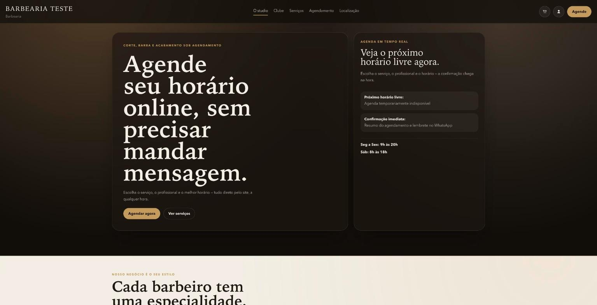
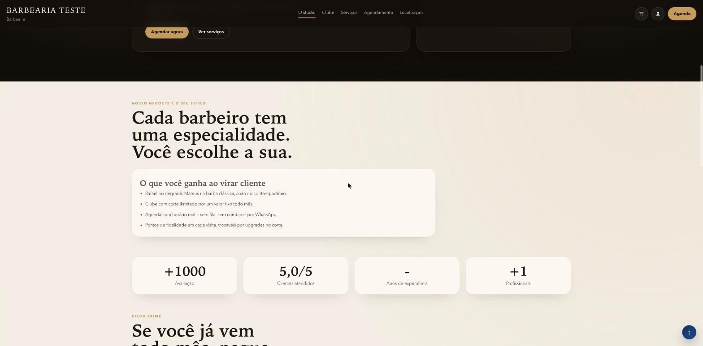
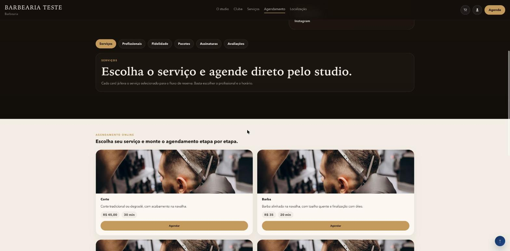
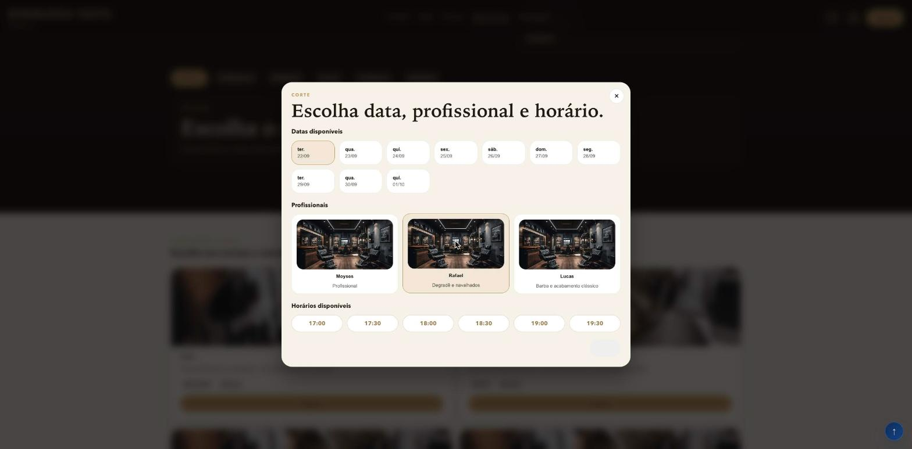
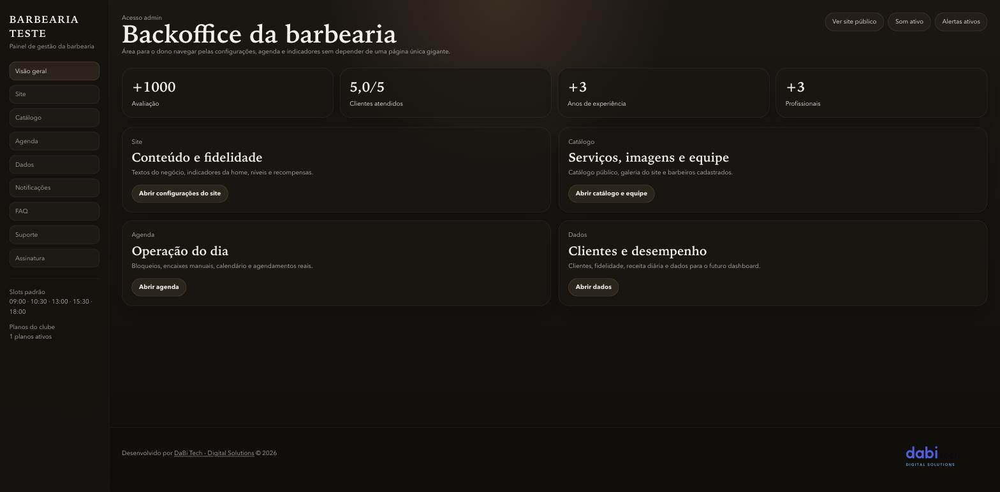
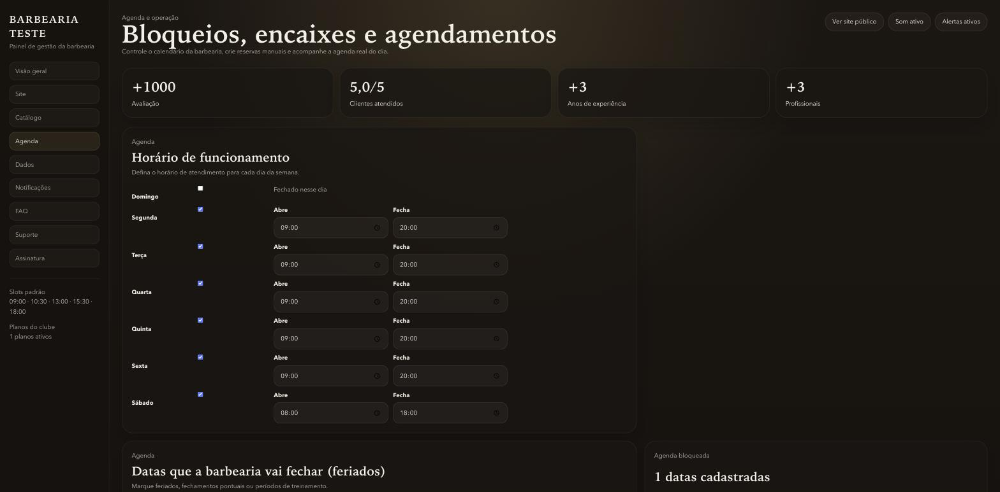
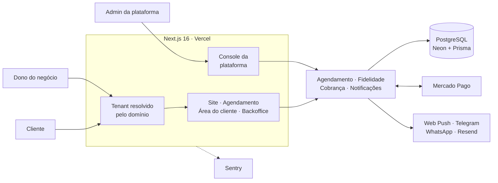

# DaBi Agendaí

**Plataforma de agendamento multi-tenant para negócios que atendem por horário marcado** (barbearias, salões, estúdios e clínicas).

Quem atende por horário costuma operar no WhatsApp e no caderno, e paga por isso com conflito de agenda, tempo perdido confirmando horário e cliente que não aparece. No Agendaí, cada estabelecimento ganha um subdomínio próprio com site, agendamento online, área do cliente, programa de fidelidade, backoffice e cobrança recorrente. O cliente agenda sozinho e o dono é avisado na hora.

> 🔒 **O código-fonte é privado** por ser um produto comercial da [DaBi Tech](https://dabitech.com.br). Este repositório documenta a arquitetura, as decisões técnicas e o meu papel no projeto. Posso liberar acesso de leitura ou apresentar o código em uma conversa técnica: [LinkedIn](https://www.linkedin.com/in/moysesemanuel/).

🔗 **Demo:** [barbearia-teste.dabitech.com.br](https://barbearia-teste.dabitech.com.br), barbearia fictícia de demonstração

---

## Meu papel

Desenvolvi o produto sozinho, de ponta a ponta:

- **Produto:** defini os módulos, os fluxos de agendamento e o modelo de planos.
- **Arquitetura:** desenhei o modelo multi-tenant por domínio, com dados e sessões isolados por estabelecimento.
- **Back-end e front-end:** Next.js 16 com App Router, Prisma e PostgreSQL, do schema às telas.
- **Integrações:** cobrança com Mercado Pago, notificações por Web Push, Telegram e WhatsApp, e-mail transacional.
- **Qualidade e operação:** testes unitários e E2E, CI no GitHub Actions, observabilidade com Sentry e deploy na Vercel.

---

## Telas

| Site do estabelecimento | Serviços | Escolha do serviço |
|---|---|---|
|  |  |  |
| **Escolha do horário** | **Backoffice** | **Agenda** |
|  |  |  |

---

## Módulos

| Módulo | O que faz |
|---|---|
| **Site institucional** | Serviços, equipe, planos, avaliações e contato, um subdomínio por estabelecimento |
| **Cadastro self-service** | O estabelecimento se cadastra, escolhe o plano e já sai no ar, sem intervenção manual |
| **Agendamento** | Serviço → profissional → data → horário, com bloqueio de horário ocupado, folgas e datas fechadas |
| **Área do cliente** | Cadastro, histórico, cancelamento, remarcação e recuperação de senha |
| **Fidelidade** | Pontos por atendimento, níveis e recompensas configuráveis |
| **Backoffice** | Agenda, serviços e produtos, equipe, horários, clientes, receita e FAQ |
| **Cobrança** | Assinatura recorrente via Mercado Pago, com bloqueio automático por inadimplência |
| **Notificações** | Aviso de novo agendamento por Web Push e Telegram, e lembretes automáticos por WhatsApp |

---

## Arquitetura

Detalhes em [docs/arquitetura.md](docs/arquitetura.md).

---

## Destaques de engenharia

**Zero agendamento duplicado.** Criar e remarcar um horário acontece dentro de uma transação com isolamento `Serializable`, que relê a agenda do profissional antes de gravar. Se dois clientes disputam o mesmo horário ao mesmo tempo, o banco rejeita um deles e a pessoa recebe uma mensagem clara para escolher outro horário. Escolhi o driver da Neon em modo WebSocket justamente porque o modo HTTP não suporta transações interativas. Veja [docs/decisoes-tecnicas.md](docs/decisoes-tecnicas.md).

**Multi-tenant de verdade.** O estabelecimento é identificado pelo domínio da requisição, todas as tabelas carregam o tenant, e as restrições de unicidade são por tenant (o mesmo telefone pode ser cliente de duas barbearias diferentes). A sessão do admin da plataforma é separada da sessão dos estabelecimentos.

**Fuso horário protegido por teste.** Agenda é sensível a fuso: um servidor em UTC desloca o "dia" perto da meia-noite. As datas são sempre calculadas no fuso de São Paulo, e um teste varre o código-fonte e falha se alguém usar `UTC` sem justificar na mesma linha.

**E2E com banco real no CI.** Toda PR roda lint, typecheck e testes unitários, depois sobe um Postgres, cria um estabelecimento de teste com credenciais geradas na hora e roda os testes E2E com Playwright. Veja [docs/testes-e-ci.md](docs/testes-e-ci.md).

**SEO e GEO.** Cada estabelecimento tem sitemap, robots, imagem Open Graph gerada dinamicamente e um `llms.txt` próprio, para ser bem lido por buscadores e por assistentes de IA.

---

## Stack

`Next.js 16` `React 19` `TypeScript` `Prisma` `PostgreSQL (Neon)` `Zod` `Mercado Pago` `Web Push` `Telegram` `WhatsApp` `Resend` `Sentry` `Vitest` `Playwright` `GitHub Actions` `Vercel`

---

## Autor

**Moyses Emanuel**, Desenvolvedor Full Stack · Curitiba, PR
[LinkedIn](https://www.linkedin.com/in/moysesemanuel/) · [GitHub](https://github.com/moysesemanuel) · [mecs.cwb@gmail.com](mailto:mecs.cwb@gmail.com)
